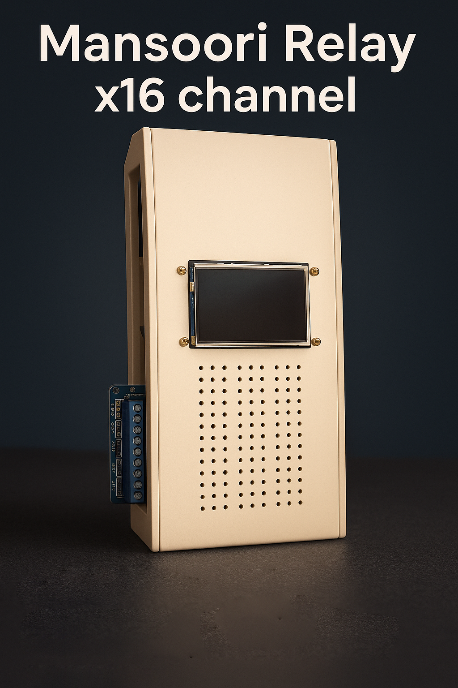

# Industrial IoT Relay Portfolio

A 16-channel industrial-grade IoT relay controller built with ESP32 firmware and FastAPI backend. Features MQTT integration, REST API, PWM fan control, thermal & surge protection, and an AI-enhanced touchscreen GUI designed in Nextion IDE.

## Project Highlights
- 16-channel relay control with industrial-grade protection
- Secure IoT communication (MQTT & REST API)
- Role-based access for multiple users
- AI-enhanced 2.8” Nextion touchscreen GUI
- Firmware CI/CD pipeline for seamless updates

## Skills Demonstrated
- Embedded Systems: ESP32, PWM, Relay Modules
- IoT & Networking: MQTT, Webhooks, Wi-Fi
- Backend & API: FastAPI, REST API
- Hardware & Power Management: Thermal & Surge Protection
- Additional Backend Skills: Laravel, NestJS, Express.js
- DevOps: CI/CD workflows for firmware deployment

## Project Media

### Device Photos
## Hardware Overview

  
  

### GUI Screenshots

### Demo Video
<video width="600" controls>
  <source src="[docs/demo.mp4](https://drive.google.com/file/d/1CmcgZSa7gOD--nTX0IZ2ZIAo9pDmQ4Am/view?usp=sharing)" type="video/mp4">
  Your browser does not support the video tag.
</video>

## Notes
- Firmware source code is private for security reasons.
- This portfolio highlights device design, IoT integration, and backend skills.
- Touchscreen interface was fully designed and programmed in Nextion IDE.
