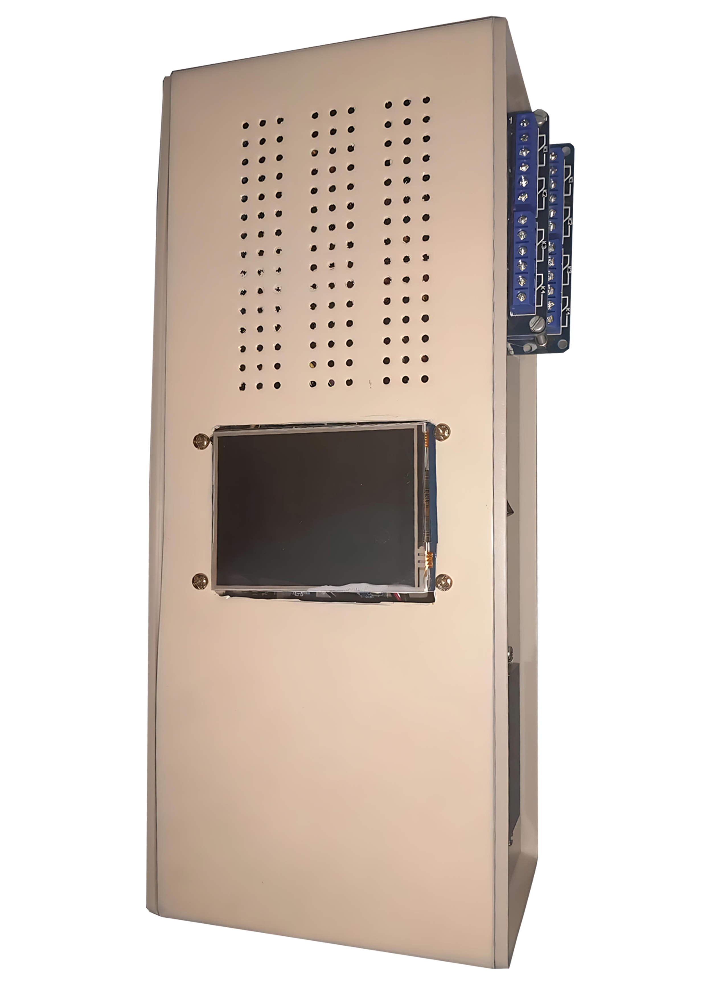
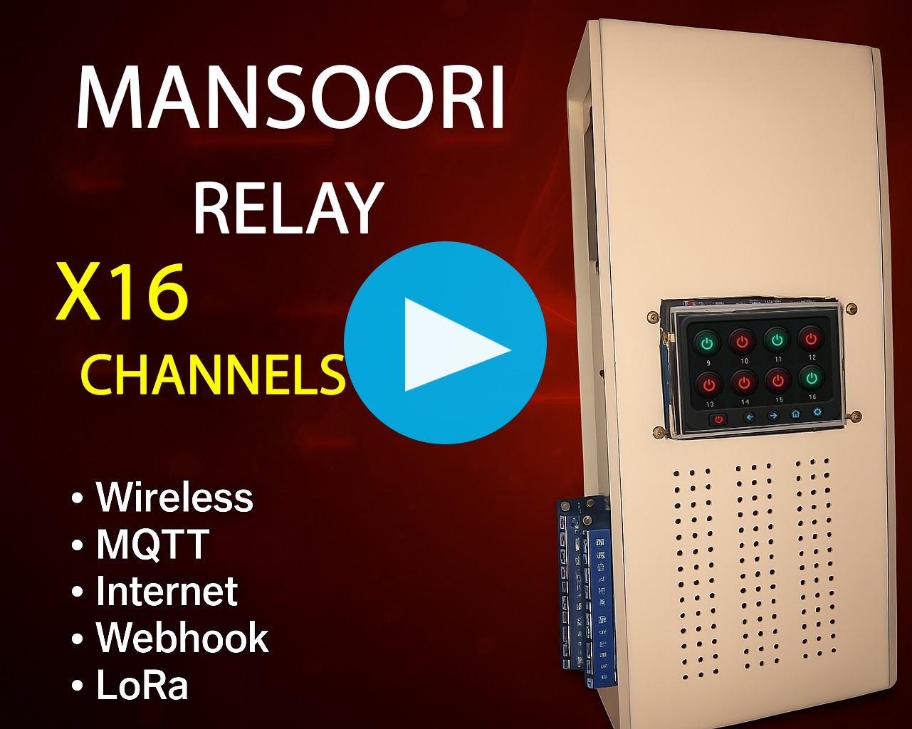
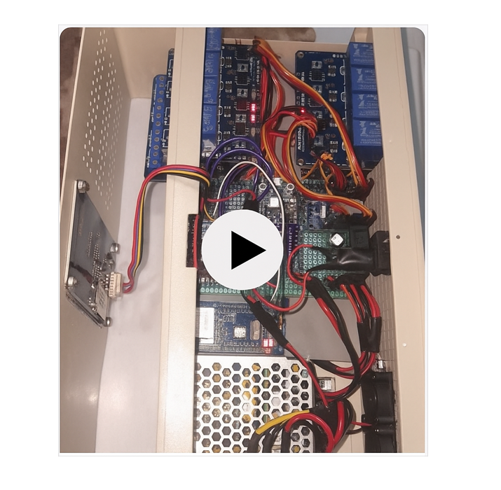

# Industrial IoT Relay Portfolio – Mansoori x16

The **Mansoori x16** is a **16-channel industrial-grade IoT relay controller** built with **ESP32 Type-C 32U** firmware and a **FastAPI backend**. Designed for industrial automation, it features:

- Robust hardware protection  
- Touchscreen interface with AI-assisted design  
- Secure IoT connectivity  
- Custom **“Mansoori Relay Case”** engineered for cooling efficiency  

---

## 📋 Table of Contents
1. [Device Photos](#device-photos)  
2. [Demo Videos](#demo-videos)  
3. [Project Highlights](#project-highlights)  
4. [Skills Demonstrated](#skills-demonstrated)  
5. [Hardware Overview](#hardware-overview)  
6. [Software & IoT Integration](#software--iot-integration)  
7. [PCB & Production Notes](#pcb--production-notes)  
8. [Future Plans](#future-plans)  
9. [Notes](#notes)  

---

## 📸 Device Photos

|  |  |
|-----------------------------------------------|------------------------------------------------|

---

## 🎬 Demo Videos

|  |  |
|----------------------------------------------------------------------------------------------------------------|----------------------------------------------------------------------------------------------------------------|

---

## 🚀 Project Highlights
- **16-channel relay control** with industrial-grade SSR protection  
- **Secure IoT communication:** MQTT, REST API, Webhooks, Wi-Fi, LoRa-ready  
- **Role-based access control:** multi-user relay permissions  
- **2.8” Nextion touchscreen GUI** with AI-assisted graphics  
- **PWM fan control** for thermal management  
- **CI/CD pipeline** for firmware updates  

---

## 🛠 Skills Demonstrated
- **Embedded Systems:** ESP32, PWM, Relay Modules  
- **IoT & Networking:** MQTT, Webhooks, Wi-Fi, LoRa-ready  
- **Backend & API:** FastAPI, REST API, JWT auth, Role/Scope-based access  
- **Hardware & Power Management:** Thermal & surge protection, industrial power integration  
- **Additional Backend:** Laravel, NestJS, Express.js  
- **DevOps:** CI/CD for firmware deployment  

---

## 🔧 Hardware Overview

### Core Components

| Component | Description |
|-----------|-------------|
| **Microcontroller** | ESP32 Type-C 32U |
| **Network Module** | W5500 Ethernet SPI |
| **PCB** | Green double-sided metallized, industrial-grade |
| **Enclosure** | Custom **Mansoori Relay Case** with airflow design |
| **Power Input** | 3-pin grounded, glass fuses 2A/3A |
| **Power Supply** | Mean Well RS-15-5 |
| **Relay Control** | 16-channel via Makazol Expander |
| **Cooling** | Dual PWM fans |
| **Temperature Sensor** | Activates fans >40°C |
| **SSR Compatibility** | Supports high-current industrial relays |

### Mechanical & Thermal Design
- Two **9×9 cm aluminum plates** with 1 mm silicone insulation  
- Raised screws for **efficient airflow**  
- Heat-sensitive parts reinforced with heatsinks  

---

## 💻 Software & IoT Integration

### User & Access Management
- Multi-user role-based permissions  
- Rename relays via touchscreen  
- Password management and Wi-Fi admin  

### Supported Protocols
- Wired & Wi-Fi internet  
- MQTT, Webhooks, REST API (JWT-based)  
- LoRa infrastructure ready  

### Dashboard & Controls
- Live fan & temperature monitoring  
- Touchscreen or web control  
- Admin defines users, roles, and relay access  

---

## 📐 PCB & Production Notes
- New PCB exists but not mass-produced  
- Green double-sided PCB used  
- Aluminum plates ensure **efficient heat dissipation**  

---

## 🔮 Future Plans
- Web-based control panel with scenario scripting  
- Full industrial automation suite  

---

## 📝 Notes
- Firmware source **private for security**  
- Touchscreen designed in **Nextion IDE** with AI-assisted graphics  
- Device supports **industrial automation, high-current control, secure IoT**  
- LoRa integration planned  
